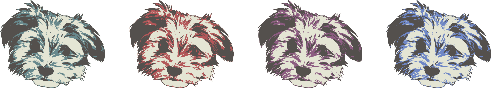

This is the homepage for my project maple, an open source software I have developed for self-monitoring your dog. The tool features audio event detection and classification, interactive plots for analyzing dog behavior, and intervening logic so that you can praise your dog for being quiet, console it for whining, scold it for barking, with pre-recorded audio of yourself.

# Development blog

The development of this entire project has been meticulously blogged and can be found [here](https://ekiefl.github.io/projects/maple)

# Installation

## Dependencies

### conda

The installation instructions assume you have [conda](https://conda.io/projects/conda/en/latest/user-guide/install/index.html). conda isn't a requirement for installing, but if you don't want to use it, you're on your own.

### portaudio

A primary module is `pyaudio`, which has `portaudio` as a dependency. If you're MacOS and aren't
averse to `brew`, you can easily install `portaudio` with

```
brew install portaudio
```

If you're on a different OS or don't like `brew`, check out the `portaudio` installation recommendations from this [lovely
discussion](https://stackoverflow.com/questions/33513522/when-installing-pyaudio-pip-cannot-find-portaudio-h-in-usr-local-include).

## Procedure

Deactivate from any conda environments you are currently in, and then create a new conda environment
called maple:

```
conda deactivate
conda create -n maple python=3.8.8
conda activate maple
```

Verify you're running `3.8.8`

```
$ python
Python 3.8.8 (default, Apr 13 2021, 12:59:45)
[Clang 10.0.0 ] :: Anaconda, Inc. on darwin
Type "help", "copyright", "credits" or "license" for more information.
>>> exit()
```

Install all of the dependencies:

```
conda install -c conda-forge python-sounddevice
conda install -c anaconda pyaudio
conda install numpy
conda install pandas
conda install scipy
conda install scikit-learn
conda install matplotlib
conda install plotly
conda install -c conda-forge tabulate
conda install -c anaconda joblib
pip install noisereduce
```

Now, its time to fetch a copy of the codebase:

```
git clone https://github.com/ekiefl/maple.git
cd maple
```

Finally, create a script that runs whenever the conda environment is activated. This script
modifies `$PATH` and `$PYTHONPATH` so that python knows where to find maple libraries and the shell knows where to find the maple binary. **These path
modifications live safely inside the maple conda environment, and do not propagate into your global
environment**:

```
mkdir -p ${CONDA_PREFIX}/etc/conda/activate.d
cat <<EOF >${CONDA_PREFIX}/etc/conda/activate.d/maple.sh
export PYTHONPATH=\$PYTHONPATH:$(pwd)
export PATH=\$PATH:$(pwd)/bin
EOF
```

Verify your installation works by activating your conda environment once more:

```
conda activate maple
```

Then, record your first session:

```
maple run
```


